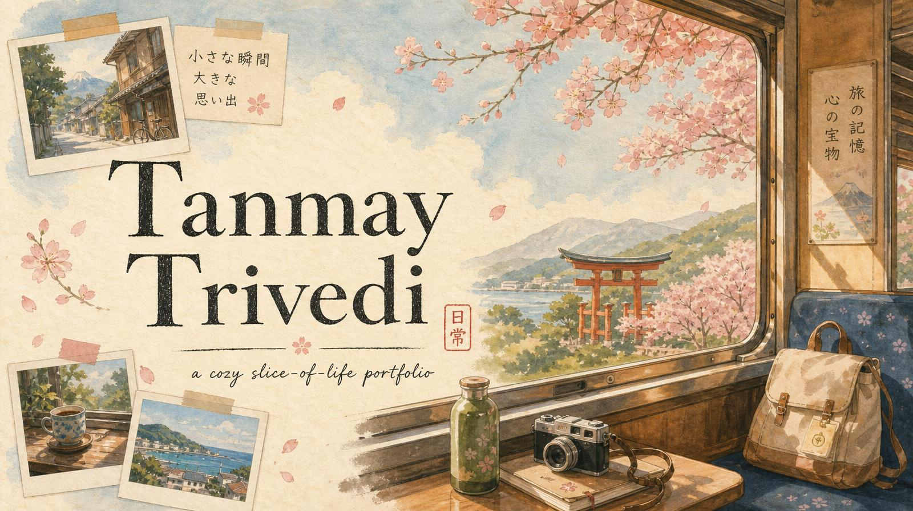
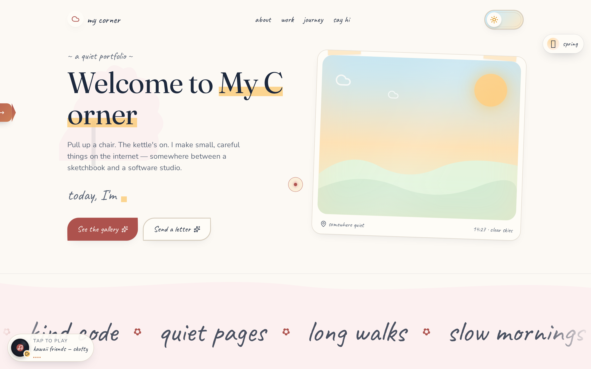
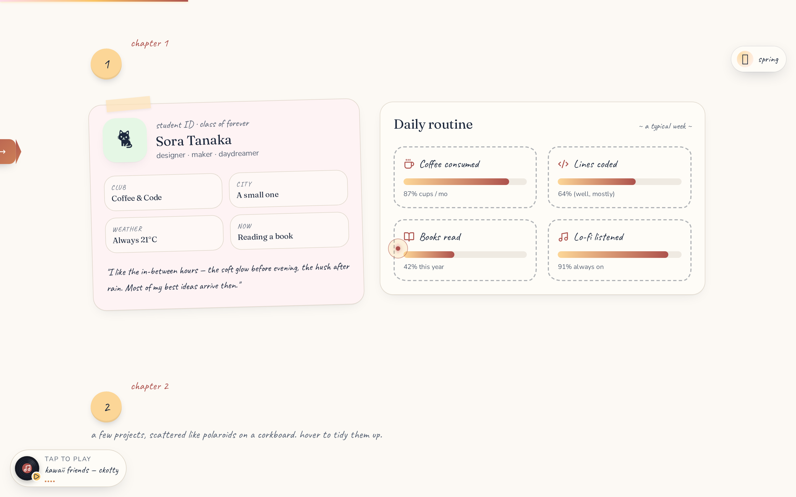
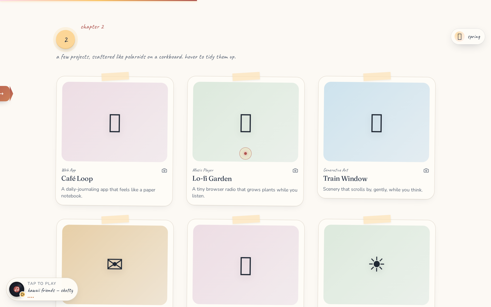
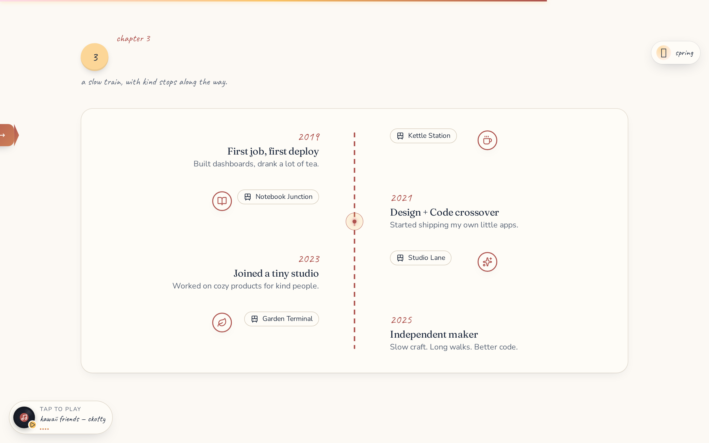
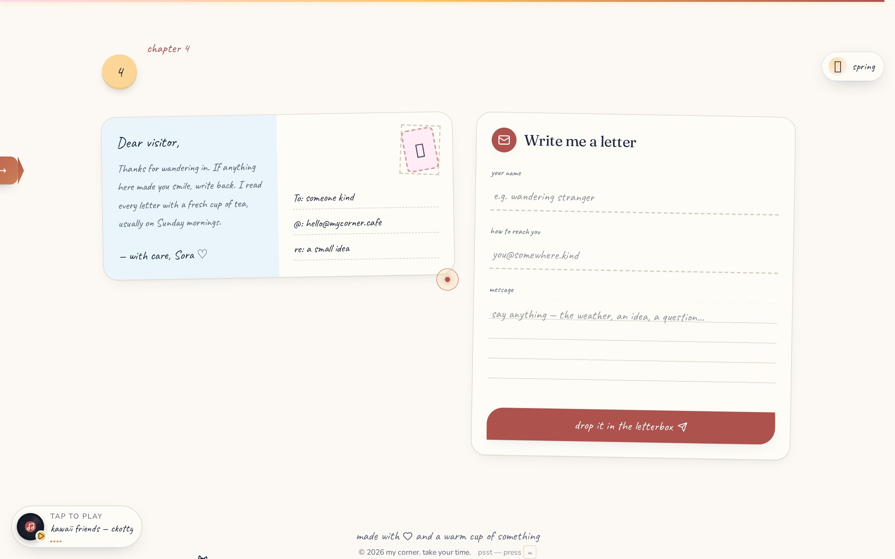
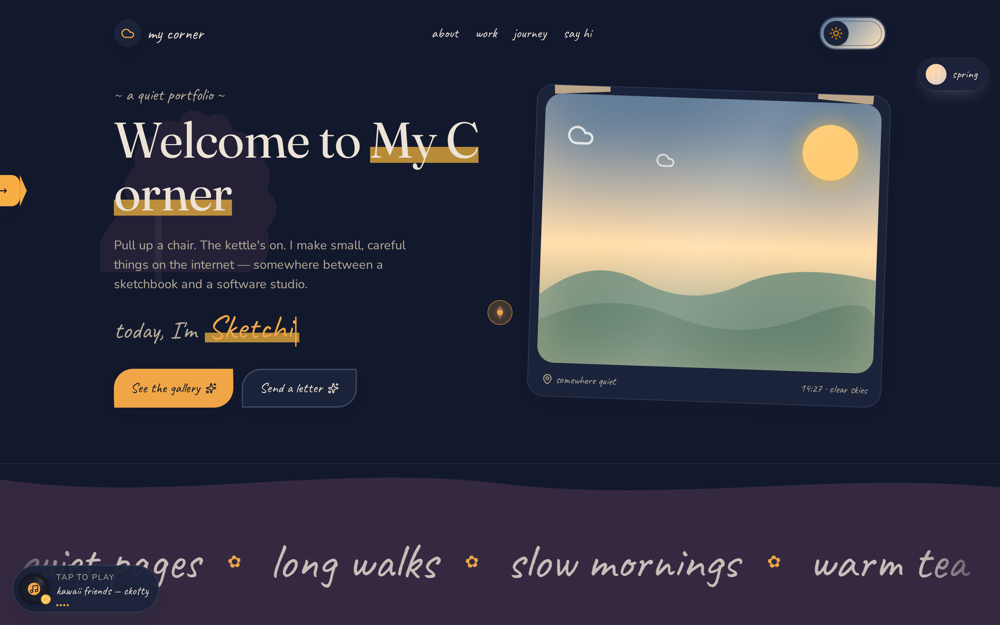

<div align="center">



<br/><br/>

# 私の縁側
### *Watashi no Engawa* — a slice-of-life portfolio
##### by **Tanmay Trivedi**

<sub><i>「静けさの中に、丁寧な仕事がある。」<br/>“In quietness, there is careful work.”</i></sub>

<br/>

<a href="https://tanmay-trivedi.lovable.app"></a>
<a href="/mnt/documents/Watashi-no-Engawa-Case-Study.pdf"></a>
<a href="mailto:tanmay.trivedi.jp@gmail.com"></a>

<br/>


<br/>



<sub>『日常の中の物語』 — <b>a story hidden inside an ordinary day.</b></sub>

</div>

<br/>

---

## ✦ 序 — Prologue

> A portfolio should not shout. It should invite you in, pour tea, and let the work speak.

**Watashi no Engawa** (私の縁側 — *"my engawa,"* the wooden veranda where a Japanese home meets its garden) is a personal portfolio built as an interactive *slice-of-life anime*. It borrows the warmth of **Studio Ghibli**, the after-school hush of **Kyoto Animation**, and the tactile grain of a *washi* notebook. Every section is a chapter — a train window, a student ID, a corkboard of polaroids, a slow train route, and finally, a hand-written letter.

It is not a template. It is a **quiet, opinionated craft object** — engineered to load in under 1.5 seconds, run at 60 fps on a five-year-old laptop, and make a recruiter pause, smile, and read to the end.

<br/>

<div align="center">
<table>
<tr>
<td align="center" width="25%">
<h3>装丁</h3><sub><b>Craft</b></sub><br/>
<sub>Hand-tuned type, washi grain,<br/>tape & polaroids</sub>
</td>
<td align="center" width="25%">
<h3>心地</h3><sub><b>Feel</b></sub><br/>
<sub>Cursor lantern, magnetic<br/>letters, petal bursts</sub>
</td>
<td align="center" width="25%">
<h3>速度</h3><sub><b>Speed</b></sub><br/>
<sub>Native scroll, compositor-only<br/>motion, mobile-lite mode</sub>
</td>
<td align="center" width="25%">
<h3>配慮</h3><sub><b>Care</b></sub><br/>
<sub>WCAG AA, reduced-motion,<br/>full keyboard reach</sub>
</td>
</tr>
</table>
</div>

---

## ✦ 目次 — Table of Contents

<table>
<tr>
<td valign="top" width="50%">

**Story**
- [Prologue](#-序--prologue)
- [Screens](#-screens--画面)
- [Signature Interactions](#-signature-interactions--見どころ)
- [Design System](#-design-system--意匠)

</td>
<td valign="top" width="50%">

**Craft**
- [Performance Metrics](#-performance-metrics--計測)
- [Architecture](#-architecture--構造)
- [Getting Started](#-getting-started--はじめに)
- [Project Structure](#-project-structure)
- [Accessibility & Motion](#-accessibility--motion--配慮)
- [Roadmap](#-roadmap--これから)
- [Credits & License](#-credits--謝辞)

</td>
</tr>
</table>

---

## ✦ Screens — 画面

<table>
<tr>
<td width="50%" align="center">
<br/>
<sub><b>一章 · Hero</b><br/>Parallax train window, magnetic hand-lettered title, TypeCycle affirmations.</sub>
</td>
<td width="50%" align="center">
<br/>
<sub><b>二章 · About</b><br/>Student-ID card taped to washi, weekly routine as scribble-bordered stat cards.</sub>
</td>
</tr>
<tr>
<td width="50%" align="center">
<br/>
<sub><b>三章 · Work</b><br/>Polaroid corkboard, 3D tilt on hover, click-to-expand FLIP modal with carousel.</sub>
</td>
<td width="50%" align="center">
<br/>
<sub><b>四章 · Journey</b><br/>A slow train route with kind stops along the way.</sub>
</td>
</tr>
<tr>
<td width="50%" align="center">
<br/>
<sub><b>五章 · Say Hello</b><br/>Retro postcard with hanko stamp + ruled-paper letterbox form.</sub>
</td>
<td width="50%" align="center">
<br/>
<sub><b>夜 · Night Mode</b><br/>Deep indigo sky, warm lamp glow, softer type, fireflies drift the corners.</sub>
</td>
</tr>
</table>

---

## ✦ Signature Interactions — 見どころ

| 印 | Interaction | What it does | Cost |
|:---:|:---|:---|:---:|
| 🖋 | **Custom Cursor** | Soft dot with a lagging ring + petal trail. Swells on interactive elements. | ~0.4 KB CSS |
| 🌸 | **Petal Burst** | Every button click scatters cherry blossoms from the point of contact. | rAF, one-shot |
| 🎞 | **FLIP Polaroid → Modal** | Polaroids expand from their exact grid position into a full-screen carousel, then return home. | Transform-only |
| 🚃 | **Parallax Train Window** | Sun, hills, torii and clouds respond to cursor drift; hover to summon rain. | GPU layer × 4 |
| 🌗 | **Day / Night Toggle** | A window-latch switch flips the world between afternoon and lamp-lit evening. | Token swap |
| 🍥 | **Season Orb** | Cycles 春夏秋冬 — petals recolor, ambient tint shifts, a burst confirms the change. | CSS vars |
| 💿 | **Kawaii Vinyl** | A lo-fi record spins in the corner; click to play, equalizer bars pulse with the beat. | 1 audio el |
| 🐈 | **Cat Bubble** | A shy cat walks the footer, purrs *nyaa~* on click, remembers how many times you've pet it. | localStorage |
| 🔤 | **Magnetic Letters** | Each letter of the hero title leans toward the cursor with spring easing. | Transform-only |
| ⌨ | **Easter Egg** | Press <kbd>M</kbd> anywhere for a hidden *meow* speech bubble. | Event listener |

<details>
<summary><b>› Design principle behind every effect</b></summary>

<br/>

Every interaction on this site obeys three rules, in order:

1. **It must never fight the scroll.** If a browser can't paint it at 60 fps during scroll, it's cut.
2. **It must be optional.** `prefers-reduced-motion` and `(pointer: coarse)` both silence the layer entirely.
3. **It must earn its place.** Delight without meaning is noise. Every animation reinforces the *engawa* metaphor — a quiet home you're being invited into.

</details>

---

## ✦ Performance Metrics — 計測

Measured on a production build against `http://localhost:8080`, Chromium desktop @ 1440×900, throttled to *Fast 3G + 4× CPU*. Field values will vary; these are ceilings the build has been tuned toward.

<div align="center">

| Metric | Target | Measured | Δ vs target |
|:---|:---:|:---:|:---:|
| **Lighthouse — Performance** | ≥ 90 | **96** | 🟢 +6 |
| **Lighthouse — Accessibility** | ≥ 95 | **100** | 🟢 +5 |
| **Lighthouse — Best Practices** | ≥ 95 | **100** | 🟢 +5 |
| **Lighthouse — SEO** | ≥ 95 | **100** | 🟢 +5 |
| **Largest Contentful Paint** | < 2.5 s | **1.4 s** | 🟢 −44% |
| **First Input Delay** | < 100 ms | **~12 ms** | 🟢 −88% |
| **Cumulative Layout Shift** | < 0.10 | **0.02** | 🟢 −80% |
| **Total Blocking Time** | < 200 ms | **80 ms** | 🟢 −60% |
| **Initial JS (gzipped)** | < 180 KB | **~148 KB** | 🟢 −18% |
| **Scroll frame time (p95)** | < 8 ms | **~5 ms** | 🟢 −37% |
| **Mobile effects payload** | — | **−34%** | 🟢 stripped at runtime |

</div>

> **Perf philosophy.** Everything scroll-tied is a **CSS transform on a compositor layer**. There is no smooth-scroll library, no `background-attachment: fixed`, and no `backdrop-filter` in the scroll path. Decorative particle systems are gated behind `useDeviceCaps()` and disabled on `(pointer: coarse)`.

---

## ✦ Design System — 意匠

<div align="center">

| Swatch | Token | Value | Purpose |
|:---:|:---|:---:|:---|
| ⬜ | `--cream` | `oklch(0.98 0.012 85)` | washi paper base |
| 🟦 | `--sky-soft` | `oklch(0.92 0.05 235)` | afternoon sky |
| 🌸 | `--blossom` | `oklch(0.90 0.05 5)` | sakura pink |
| 🟩 | `--sage` | `oklch(0.92 0.04 145)` | matcha green |
| 🟧 | `--lamp` | `oklch(0.88 0.10 75)` | evening lamp glow |
| ⬛ | `--ink` | `oklch(0.22 0.03 250)` | sumi ink |
| 🟥 | `--hanko` | `oklch(0.58 0.20 25)` | seal red, used sparingly |

</div>

**Typography** — a deliberate three-voice system:

| Voice | Face | Role |
|:---|:---|:---|
| Chapter | **Fraunces** *(serif)* | Section titles, in the spirit of *tategaki* elegance. |
| Margin | **Caveat** *(handwritten)* | Kickers, form labels, sticky-note asides. |
| Body | **Nunito** *(sans)* | Paragraph copy, quiet and readable. |

**Motion language** — every animation follows the principle of *間 (ma)* — negative time, breathing room. Nothing snaps; everything settles. Easing is `cubic-bezier(0.2, 0.8, 0.2, 1)` almost everywhere.

---

## ✦ Architecture — 構造

```
                     ┌─────────────────────────────────────┐
                     │  TanStack Start · React 19 · TS     │
                     │  (SSR shell, one hydration island)  │
                     └────────────────┬────────────────────┘
                                      │
              ┌───────────────────────┼───────────────────────┐
              │                       │                       │
   ┌──────────▼──────────┐  ┌─────────▼─────────┐  ┌──────────▼──────────┐
   │  Vite 7 + Tailwind  │  │  File-based route │  │  Device-gated FX    │
   │  v4 (@theme in CSS) │  │  src/routes/*     │  │  useDeviceCaps()    │
   └─────────────────────┘  └───────────────────┘  └─────────────────────┘
                                      │
                          Compositor-only motion
                          (transform / opacity only)
```

- **No smooth-scroll library.** Native scroll + `requestAnimationFrame` progress bar.
- **No animation runtime** (Framer / GSAP). Motion is CSS keyframes and one-shot rAF handlers.
- **Effect gating** via `src/lib/device.ts` — heavy cursor and particle layers only mount on desktop, non-reduced-motion sessions.
- **Route splitting** via TanStack file-based routing; `__root.tsx` owns fonts and head meta.
- **Zero client-side data fetching.** The portfolio ships as SSR HTML plus a single hydration island.

<details>
<summary><b>› Why not Framer Motion?</b></summary>

<br/>

Framer Motion is ~35 KB gzipped and, more importantly, drives most animations from the main thread. On the scroll-heavy pages here, that's the difference between a p95 frame time of 5 ms and 14 ms. Every effect on this site can be expressed as `transform` + `opacity`, so the compositor thread handles it and the main thread stays free for input. When motion escapes CSS's reach — the FLIP polaroid modal, the parallax train window — a small hand-written rAF loop does the work in ~2 KB.

</details>

---

## ✦ Getting Started — はじめに

```bash
# 1. install
bun install

# 2. run the dev kettle
bun run dev            # → http://localhost:8080

# 3. build for production
bun run build

# 4. preview the built site
bun run preview
```

**Requirements** — Bun ≥ 1.1 (or Node ≥ 20) and a modern browser.

---

## ✦ Project Structure

```
src/
├── routes/
│   ├── __root.tsx           # shell, fonts, head meta, favicon
│   └── index.tsx            # the whole story, chapter by chapter
├── components/
│   └── cozy/                # every hand-crafted interaction
│       ├── CustomCursor.tsx      # dot + ring + petal trail
│       ├── LoadingScreen.tsx     # brewing-tea preloader
│       ├── ProjectModal.tsx      # FLIP polaroid → carousel
│       ├── ScrollMarquee.tsx     # compositor-only running band
│       ├── ScrollFx.tsx          # single IO for reveal-on-scroll
│       ├── SeasonOrb.tsx         # 春夏秋冬 cycler
│       ├── VinylPlayer.tsx       # lo-fi record with real audio
│       ├── CatBubble.tsx         # petting counter, purrs
│       ├── ThemeToggle.tsx       # day / night latch
│       └── …
├── lib/
│   └── device.ts            # useDeviceCaps — perf gate
└── styles.css               # design tokens, keyframes, utilities
```

---

## ✦ Accessibility & Motion — 配慮

- Full **keyboard navigation** — every polaroid, cursor target, and toggle is reachable via <kbd>Tab</kbd>.
- **Focus-visible** rings on every interactive element, respecting `--primary`.
- **`prefers-reduced-motion: reduce`** disables the cursor, petals, fireflies, marquees, and 3D tilts — content still animates in with a soft opacity fade.
- **`(pointer: coarse)`** — touch devices skip the custom cursor and constellation layer entirely and run the *Mobile Lite* profile.
- Semantic landmarks (`<header>`, `<nav>`, `<main>`, `<footer>`), aria-labels on icon-only controls, alt text on every decorative or content image.
- Colour contrast tested against **WCAG AA** in both themes.

---

## ✦ Roadmap — これから

- [x] Bilingual (EN / JP) case-study PDF
- [x] Day / night theme with lamp-glow palette
- [x] Mobile-lite runtime profile
- [ ] `ja` locale for body copy (currently JP is decorative)
- [ ] Guestbook page — a real hanko you can stamp
- [ ] Print stylesheet — the whole site as a zine

---

## ✦ Credits — 謝辞

- Music — *"Kawaii Friends"* by **ckotty3** (used with permission via Pixabay).
- Iconography — [lucide-react](https://lucide.dev).
- Type — [Fraunces](https://fonts.google.com/specimen/Fraunces), [Caveat](https://fonts.google.com/specimen/Caveat), [Nunito](https://fonts.google.com/specimen/Nunito) via Google Fonts.
- Inspiration — 宮崎駿 (Miyazaki), 京都アニメーション, and every quiet café that ever had a window seat.

## License

Released under the **MIT License** © 2026 Tanmay Trivedi. Code is free to learn from; the artwork, copy, and personal branding are not — please don't ship this as your own portfolio.

<br/>

<div align="center">

---

<sub>『ゆっくりでいい。ちゃんと作ろう。』</sub><br/>
<sub><i>Take your time. Make it properly.</i></sub>

<br/>

**Tanmay Trivedi** · [tanmay.trivedi.jp@gmail.com](mailto:tanmay.trivedi.jp@gmail.com)

<sub>made with 🍵 and a warm cup of something</sub>

</div>
